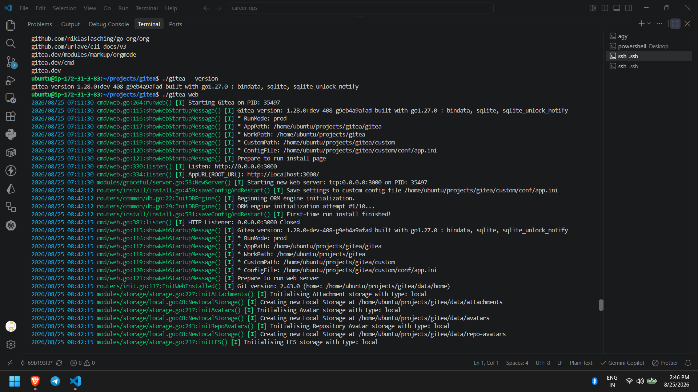
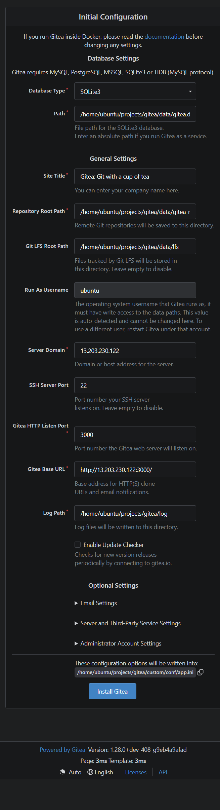
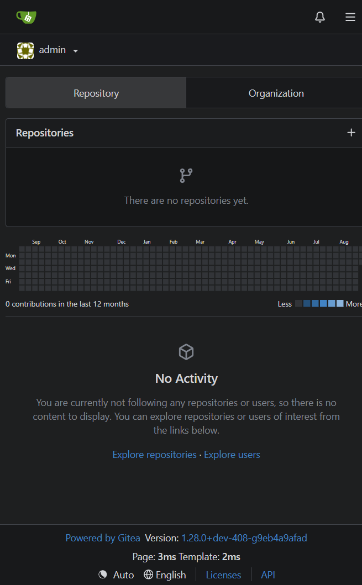

# Gitea Local Setup Pre-Internship Assignment

## Task Overview

This repository contains my submission for the Gitea local setup pre-internship assignment.

The objective of this task was to clone the Gitea project, understand its basic repository structure, configure the required development environment, build Gitea from source without Docker, run it successfully, and document the setup and troubleshooting process.

## Repository

The official Gitea repository was cloned from:

https://github.com/go-gitea/gitea

## Prerequisites & Environment

Before building Gitea from source, the following prerequisites and tools were installed and configured:

- **Go** (version 1.27.0)
- **Node.js** (version 24.19.0)
- **npm** (version 11.17.0)
- **pnpm** (version 11.22.0)
- **Make** (version 4.3)
- **Git** (version 2.43.0)
- **SQLite** (version 3.45.1)
- **UV** (version 0.12.5)

## Setup Process

1. **Clone the repository**

   ```bash
   git clone https://github.com/go-gitea/gitea.git
   cd gitea
   ```

2. **Verify the repository**

   ```bash
   git branch --show-current
   git remote -v
   ```

3. **Install dependencies**

   ```bash
   make deps
   ```

   _Note: The project uses `pnpm` for frontend dependencies, so `pnpm` was installed before successfully running the dependency installation._

4. **Build Gitea**
   Gitea was built from source using:

   ```bash
   TAGS="bindata sqlite sqlite_unlock_notify" make build
   ```

5. **Verify the build**

   ```bash
   ./gitea --version
   ```

   The resulting build was:

   ```text
   gitea version 1.28.0+dev-408-g9eb4a9afad built with go1.27.0 : bindata, sqlite, sqlite_unlock_notify
   ```

6. **Run Gitea**

   ```bash
   ./gitea web
   ```

   Gitea was configured to listen on port 3000.

   

   Upon running, accessing the Gitea web interface displays the initial Gitea configuration page:

   

## Issues Encountered and Troubleshooting

### Issue 1 — pnpm was missing

The initial `make deps` command failed with:

```text
make: pnpm: No such file or directory
```

**Resolution:**
I identified that `pnpm` was required by the project's build process and installed it using `npm`.
After installing `pnpm`, I ran `make deps` again and the dependency installation completed successfully.

### Issue 2 — uv was missing

The build also reported:

```text
make: uv: No such file or directory
```

**Resolution:**
I installed `uv` and resumed the build.

After resolving these issues, the Gitea build completed successfully.

## Verification

The application was started using:

```bash
./gitea web
```

After completing the initial configuration, the Gitea dashboard is displayed:



A video demonstration of the local setup and verification is available here: [Loom Demonstration](https://www.loom.com/share/866ee6efe30f4583ae7c171a5cc52ca0)
